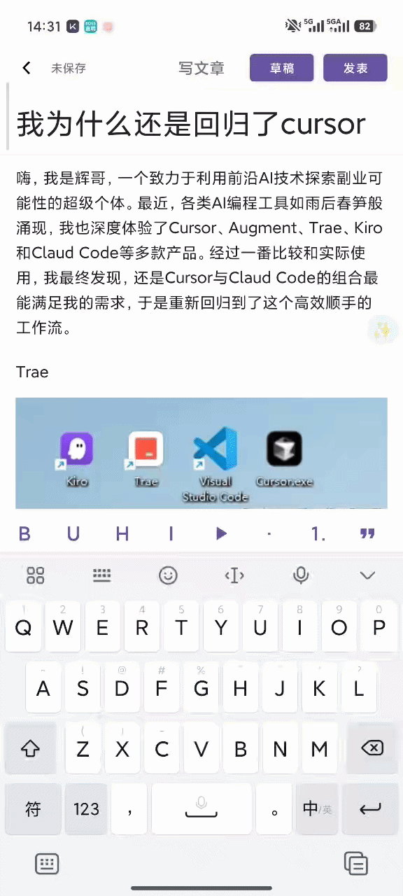
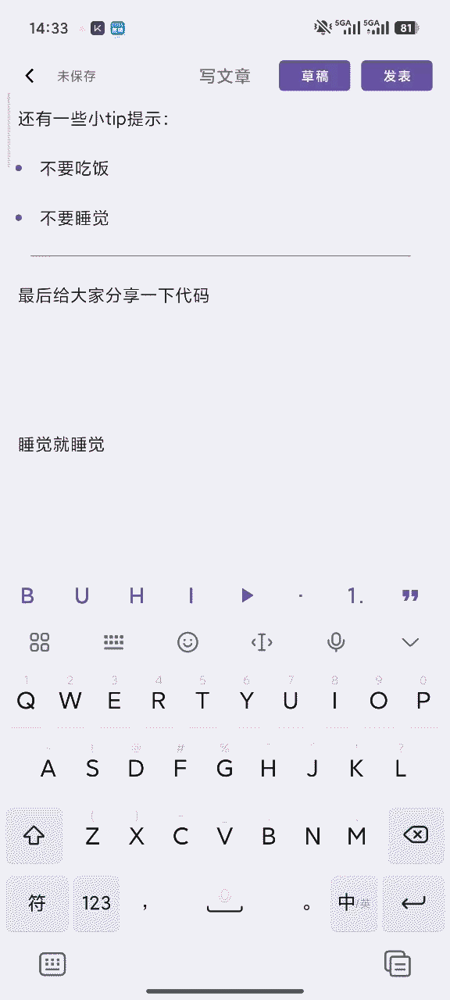
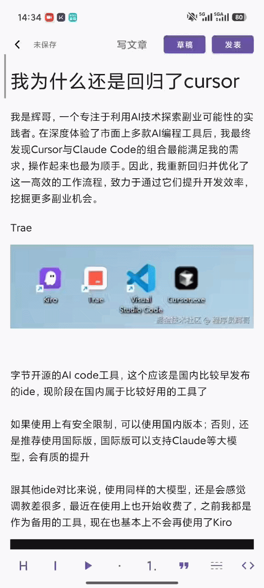
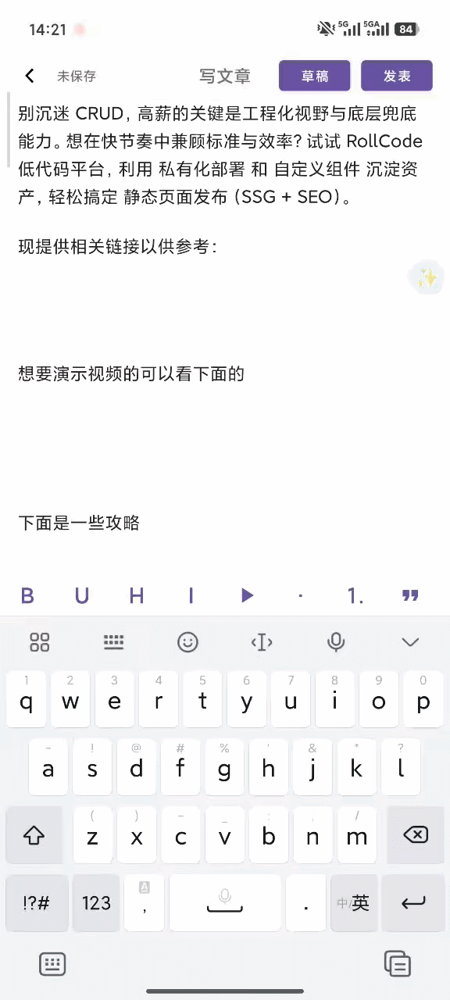

<p align="center">
  <h1 align="center">🐟 FishMemory</h1>
</p>


**FishMemory** 是一款 Android 端资讯阅读与内容发布应用。其核心亮点是内置了一个**纯原生的块式富文本编辑器**（非 WebView 实现），并深度集成了 DeepSeek AI 提供流式写作辅助。项目采用 Clean Architecture 与模块化设计，具备良好的可扩展性。

## 🛠 技术栈

- **开发语言**: Kotlin (Coroutines & Flow)
- **架构设计**: MVVM + Repository (Clean Architecture)
- **UI 框架**: ViewBinding, RecyclerView (复杂多类型列表处理)
- **本地存储**: Room Database
- **网络通信**: Retrofit + OkHttp + Server-Sent Events (SSE)
- **多媒体**: Glide (图片加载), uCrop (裁剪), Media3 ExoPlayer (视频播放)

## ✨ 核心功能

### ✍️ 原生块式富文本编辑器 (核心)
- **多维度块类型**: 支持标题、正文、加粗/下划线/删除线、引用、列表（有序/无序）、**代码块（支持语法高亮）**、图片、视频、链接卡片及分割线。
- **极致交互体验**: 
  - 基于 RecyclerView 实现块级独立编辑与跨块焦点无缝切换。
  - 支持图片的动态裁剪、替换与大图预览。
  - 完善的软键盘适配与 IME (输入法) 状态监听。

### 🤖 AI 智能写作辅助
- **流式响应**: 深度集成 DeepSeek 接口，基于 SSE 实现“打字机”式的流式文本输出。
- **多模式润色**: 提供“更正式”、“更简短”、“扩写”等多种 AI 交互指令。
- **无损反悔机制**: 提供实时预览态（Preview），支持一键替换、重试或放弃，保障用户原稿数据安全。

### 💾 健壮的草稿与数据管理
- **自动防丢**: 监听输入状态，内容变更后自动触发延迟防抖保存。
- **增量同步**: 基于 Room 数据库的本地增量更新与时间戳冲突处理。

### 📖 资讯浏览与互动
- 首页分类导航与信息流瀑布展示。
- 高性能的文章详情页（复用富文本渲染引擎）。
- 本地状态同步的点赞与收藏功能。


## 🏗 项目架构

项目遵循 **Clean Architecture** 原则，实现了 UI 平台依赖与核心业务逻辑的严格分离：

```text
app/src/main/java/com/fishmemory/app/
├── core/                    # 基础工具、网络配置、全局扩展
├── data/                    # Repository 实现、Room 数据库、Model 映射
├── ui/                      # UI 层 (Activity/Fragment, ViewModel)
│   ├── home/                # 首页与信息流
│   ├── articledetail/       # 文章详情模块
│   ├── publish/             # 发布模块 (核心)
│   │   ├── richtext/        # ➡️ 独立富文本 SDK 层
│   │   │   ├── core/        # Block 模型、正则解析、Span 应用
│   │   │   ├── ui/          # ViewHolder 动态绑定、Adapter 控制
│   │   │   ├── business/    # 媒体协调器、视频/图片业务逻辑
│   │   │   └── config/      # 编辑器全局配置
│   │   ├── ai/              # AI 润色状态机管理
│   │   └── draft/           # 草稿箱侧滑栏与逻辑
│   └── mine/                # 个人中心模块
└── MainActivity.kt          # 主路由入口
```
## 📸 效果展示
<table align="center" width="100%">
  <tr>
    <td width="50%" align="center">
      <b>✨ AI 智能润色</b><br>
      <br>
      <sub>支持 DeepSeek 流式输出，一键优化文章内容</sub>
    </td>
    <td width="50%" align="center">
      <b>💻 多语言代码块</b><br>
      <br>
      <sub>基于 Prism4j 实现，支持主流编程语言高亮</sub>
    </td>
  </tr>

  <tr>
    <td width="50%" align="center">
      <b>📂 本地文件管理</b><br>
      <br>
      <sub>直观的层级结构，快速切换与检索文章</sub>
    </td>
    <td width="50%" align="center">
      <b>📝 沉浸式草稿箱</b><br>
      <br>
      <sub>实时自动保存，防止任何灵感丢失</sub>
    </td>
  </tr>

  <tr>
    <td colspan="2" align="center">
      <br>
      <b>🔗 智能超链接卡片</b><br>
      <br>
      <sub>自动解析 URL 元数据，生成精美的预览块</sub>
    </td>
  </tr>
</table>

## 📅 待办事项 (TODO)
- [ ] 接入云端同步机制与账号体系

- [ ] 评论系统与消息互动

- [ ] 全文检索与标签过滤

- [ ] 暗黑模式 (Dark Mode) 深度适配
      
- [ ] sdk化编辑器

- [ ] 探索更多 AI 场景（全文摘要生成、上下文续写）

## 📄 License
本项目基于 MIT License 开源。
