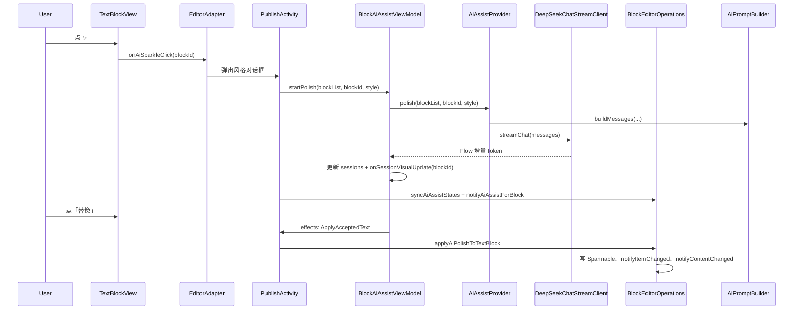

# FishMemory：正文块 AI 润色实现说明

## 1. 目标与约束

- **目标**：在块状编辑器里，对单个 **文本块** 做可插拔 AI 流式润色；FishMemory 当前默认实现为 DeepSeek（OpenAI 兼容）；**未点「替换」前不改 `EditorBlock`**。
- **约束**：AI 中间态放在 **ViewModel**，不污染核心块模型；SDK 只暴露 **`AiAssistProvider`** 扩展接口，密钥经 App 侧 **`local.properties` → `BuildConfig`** 注入；RecyclerView 内 **禁止在 layout 过程中直接 `notifyItemChanged`**。

---

## 2. 模块与文件位置

| 职责 | 路径（主要） |
|------|----------------|
| 润色风格枚举 | `richtext-editor/src/main/java/com/fishmemory/app/ui/publish/ai/AiPolishStyle.kt` |
| UI 状态（Idle/Loading/Streaming/Preview/Error） | `richtext-editor/src/main/java/com/fishmemory/app/ui/publish/ai/AiAssistUiState.kt` |
| AI 扩展接口 | `richtext-editor/src/main/java/com/fishmemory/app/ui/publish/richtext/api/AiAssistProvider.kt` |
| Prompt：前文 2～3 块 + 目标段 | `app/src/main/java/com/fishmemory/app/ui/publish/ai/AiPromptBuilder.kt` |
| OkHttp SSE → `Flow<String>` | `app/src/main/java/com/fishmemory/app/ui/publish/ai/DeepSeekChatStreamClient.kt` |
| DeepSeek provider 实现 | `app/src/main/java/com/fishmemory/app/ui/publish/ai/DeepSeekAiAssistProvider.kt` |
| 会话、流式收集、Accept 副作用 | `app/src/main/java/com/fishmemory/app/ui/publish/ai/BlockAiAssistViewModel.kt`、`BlockAiAssistViewModelFactory` |
| 写回正文副作用 | `AiAssistEffect.ApplyAcceptedText`（同包内 sealed） |
| 块内 ✨ / 预览 / 三按钮 | `richtext-editor/src/main/java/com/fishmemory/app/ui/publish/richtext/ui/view/TextBlockView.kt` |
| ViewHolder 绑定 AI | `richtext-editor/src/main/java/com/fishmemory/app/ui/publish/richtext/ui/adapter/TextBlockViewHolder.kt` |
| Payload 局部刷新、延迟 notify | `richtext-editor/src/main/java/com/fishmemory/app/ui/publish/richtext/ui/adapter/EditorAdapter.kt` |
| 焦点与 AI 回调、写回模型 | `richtext-editor/src/main/java/com/fishmemory/app/ui/publish/richtext/ui/container/BlockEditorOperations.kt` |
| 对外 Facade | `richtext-editor/src/main/java/com/fishmemory/app/ui/publish/richtext/ui/container/BlockEditorRecyclerView.kt` |
| Activity 接线、风格对话框 | `app/src/main/java/com/fishmemory/app/ui/publish/PublishActivity.kt` |
| 失焦回调（避免 ✨ 残留） | `richtext-editor/src/main/java/com/fishmemory/app/ui/publish/richtext/core/BlockCallbacks.kt`（`onFocusLost`）、`BlockEditText.kt` |
| 密钥与 BuildConfig | `app/build.gradle.kts`（显式读 `local.properties`） |

---

## 3. 数据流（端到端）

---

## 4. 核心实现要点

### 4.1 SDK 接口与 App 实现

- **`AiAssistProvider`** 位于 `:richtext-editor` 的 `api/` 包，方法签名是 `polish(blockList, blockId, style): Flow<String>`。
- SDK 通过接口表达“我要润色某个文本块”，不关心模型厂商、Key、Prompt、网络协议和鉴权方式。
- **`DeepSeekAiAssistProvider`** 位于 app 侧，实现 `AiAssistProvider`，内部继续复用 `AiPromptBuilder` 与 `DeepSeekChatStreamClient`。
- **`BlockAiAssistViewModel`** 只依赖 `AiAssistProvider`，不再直接创建 DeepSeek client，也不直接读取 `BuildConfig`。

### 4.2 密钥与 BuildConfig

- **`local.properties`** 里写 `DEEPSEEK_API_KEY=...`。
- **`app/build.gradle.kts`** 用 `java.util.Properties` **显式加载** `rootProject.file("local.properties")`，再 `buildConfigField`；`project.findProperty` **单独读不到** `local.properties` 里的自定义键。
- 运行时通过 **`BuildConfig.DEEPSEEK_API_KEY`** 创建 `DeepSeekAiAssistProvider`，再注入 `BlockAiAssistViewModelFactory`。

### 4.3 网络层（流式）

- **`DeepSeekChatStreamClient`**：独立 `OkHttpClient`（长 read timeout），`POST` 到 `https://api.deepseek.com/v1/chat/completions`，`stream: true`。
- 响应体按行读 SSE：`data: {...}`，Gson 解析 `choices[0].delta.content`，`callbackFlow` 里 `trySend` 每个增量字符串。

### 4.4 ViewModel 状态机

- **`MutableStateFlow<Map<String, AiAssistUiState>>`**：按 `blockId` 存会话；**无 key 视为 Idle**。
- **`startPolish`**：`Loading` → 调用 `AiAssistProvider.polish` → collect 流式 → `Streaming(accumulated)` → 结束 → `Preview`；异常 → `Error`。
- **缺少 Key**：App 侧 provider 抛出 `AiAssistProvider.MissingCredentialsException`，ViewModel 转成本地化错误文案。
- **`accept`**：发 **`Channel` / `Flow` 的 `AiAssistEffect.ApplyAcceptedText`**，再清会话（Activity 监听后调 Operations 写正文）。
- **`retry` / `discard`**：`lastStyleByBlock` 记风格；discard 取消 `Job` 并移除会话。
- **`onSessionVisualUpdate`**：由 Activity 设置，用于 **只刷新该块 AI UI**。

### 4.5 Prompt（上下文）

- **`AiPromptBuilder.buildMessages`**：根据 `blockId` 找目标 `TextBlock`，向前最多 **3 个** 非空 **`TextBlock`** 的纯文本作「背景」；目标段用 **`text.toString()`**（不保留 Span）；system/user 分工在代码注释里说明。

### 4.6 UI：块内 ✨ 与预览

- **`TextBlockView`**：主列为「原 `container` + `aiSection`」；右下角 **`sparkleFab`**；`aiSection` 内含 ProgressBar、预览 `TextView`、三个 **`AppCompatButton`**（避免 Material attr 在部分 Context 下崩）。
- **`TextBlockViewHolder.bindAiAssist`**：`showSparkle` = 当前块 id == `focusedTextBlockId` **且** `editText.hasFocus()` **且** 非空 **且** 状态为 **Idle**。

### 4.7 RecyclerView：焦点与刷新

- **`EditorAdapter.focusedTextBlockId`**：在 **`BlockEditorOperations.setFocusedTextBlockForAi`** 里与 **`onFocusGained`**（正文）、**`onCodeBlockFocusGained`**（清正文焦点）同步，并 `notifyAiAssistForBlock` 旧/新块。
- **`BlockInteractionListener.onFocusLost`**：正文失焦时清 `focusedTextBlockId` 并刷新 AI payload（见下）。
- **`PAYLOAD_AI_ASSIST`**：`onBindViewHolder(holder, position, payloads)` 里只调 **`bindAiAssist`**，不重绑全文，避免打断 IME。
- **`onContentChanged` / `onFocusLost` 里 `notifyItemChanged`**：必须 **`Handler.post`** 延后（**`scheduleAiAssistItemRefresh`**），否则 **`bind` → `setText` → TextWatcher → notify** 会在 **layout 中** 触发 `IllegalStateException`。

### 4.8 写回正文（Accept）

- **`BlockEditorOperations.applyAiPolishToTextBlock`**：找到 `EditorBlock.TextBlock`，**`clear()` + `append(plainText)`**（首版纯文本），**全量 `notifyItemChanged`** 该 item，并 **`notifyContentChanged()`** 给草稿等逻辑。

---

## 5. Activity 接线（Publish）

- **`ViewModelProvider` + `BlockAiAssistViewModelFactory`** 创建 ViewModel，并注入 `DeepSeekAiAssistProvider(BuildConfig.DEEPSEEK_API_KEY)`。
- **`onSessionVisualUpdate`**：`syncAiAssistStates(sessions.value)` + `notifyAiAssistForBlock(blockId)`。
- **`configureAiAssistCallbacks`**：✨ → 弹 **`MaterialAlertDialogBuilder.setItems`**（三种风格）；Accept/Retry/Discard → ViewModel。
- **`lifecycleScope` + `repeatOnLifecycle`** 收集 **`effects`**，收到 **`ApplyAcceptedText`** 后调 **`applyAiPolishToTextBlock`**。
- **`onDestroy`**：`onSessionVisualUpdate = null`，避免泄漏。

---

## 6. 调试与排错

- **BuildConfig 仍为空**：确认密钥写在**工程根目录** `local.properties` 的 `DEEPSEEK_API_KEY=`；`app/build.gradle.kts` 已显式 `load(local.properties)`，勿仅依赖 `project.findProperty`。修改后 **Clean + Rebuild**。
- **`IllegalStateException`（layout 中 notify）**：`onContentChanged` / 失焦刷新 AI 条须 **`Handler.post`**（`scheduleAiAssistItemRefresh`），禁止在 `bind → setText → TextWatcher` 同步链里直接 `notifyItemChanged`。
- **HTTP 401/403**：检查 Key、账户余额与请求 URL；块下方 Error 文案为截断后的服务端/客户端信息。

---

*文档版本：与源码同步维护；最后更新以 Git 为准。*
