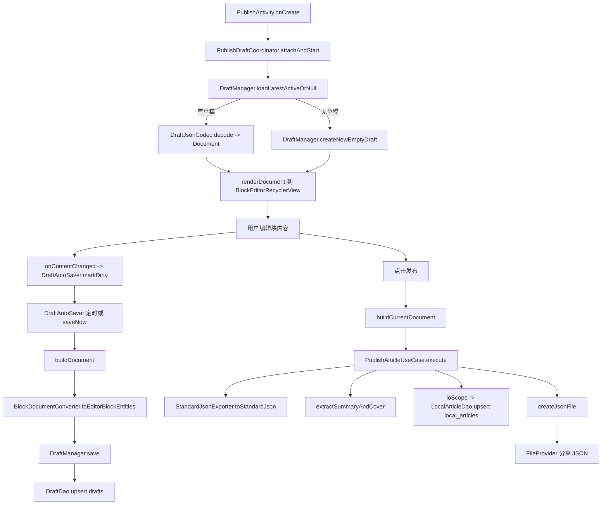
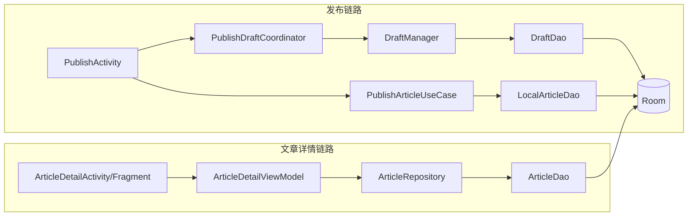

# FishMemory 发布与富文本架构深度解析（面试版）

## 1. 架构结论（先说结论）

项目是混合分层架构，不是纯 MVVM/MVI/Clean：

- 主干采用按功能分包，部分模块是 `ViewModel -> Repository -> Room`（如文章详情链路）。
- 发布链路采用 `Activity + Coordinator + UseCase + Manager`；**主发布流程不强制使用「发布页专用 ViewModel」**。AI 润色单独使用 `BlockAiAssistViewModel`（见 `docs/ai-polish-implementation.md`）。
- 富文本编辑器采用“领域内核 + UI 外壳”：
  - 内核：`BlockActionManager`、`SelectionManager`、`FocusManager`
  - 外壳：`BlockEditorRecyclerView`、`EditorAdapter`
- 本地数据核心是 Room（`DraftDao` / `LocalArticleDao` / `ArticleDao`），当前源码未使用 DataStore。

---

## 2. 核心模块职责边界

### `ui/publish`（发布编排层）

- `PublishActivity`
  - 页面入口与事件分发（工具栏按钮、媒体选择、发布点击、分享结果）
  - 不承担草稿持久化细节、不承担块结构算法
- `PublishDraftCoordinator`
  - 维护“当前草稿会话”
  - 负责 attach、切换草稿、自动保存状态文案、生命周期补保存
  - 通过 `buildDocument/renderDocument` 与编辑器解耦
- `PublishArticleUseCase`
  - 将 `Document` 导出为标准 JSON
  - 生成摘要与封面
  - 异步写入 `LocalArticleEntity`
  - 输出可分享 JSON 文件
- `BlockEditorRecyclerView`
  - 对外提供 `setBlocks/getBlocks`、插入/删除/聚焦等能力
  - 内部委托给 action/selection/focus 组件

### `DraftManager`（草稿数据服务层）

- 聚焦草稿数据读写与编码：
  - `loadLatestActiveOrNull`
  - `loadByIdOrNull`
  - `createNewEmptyDraft`
  - `save`
  - `markOpened`
- 屏蔽 Room Entity，外部只操作 `Document`
- 内聚字数/预览摘要计算逻辑，防止 UI 重复实现

---

## 3. “创建 -> 编辑 -> 暂存 -> 发布”全链路数据流

---

## 4. UI / ViewModel / Repository / Room 流转图（项目全景）

---

## 5. 块状编辑器：数据结构与性能策略

### 5.1 数据结构分层

- 文档根：`Document(title, blocks)`
- 编辑态：`EditorBlock`（`Text/Image/Video/Hr/Code/LinkCard`）
- 持久化态：`EditorBlockEntity`
- 转换层：`BlockDocumentConverter`

设计收益：编辑器可高频变更，持久化模型保持稳定，转换边界明确可测试。

### 5.2 复杂场景的结构定义

- 有序/无序列表
  - `TextBlock.listType` + `orderIndex`
  - 每次结构变化调用 `recalculateNumberListOrderIndexes()` 统一编号
- 引用块
  - `TextBlock.isQuote`
  - 切换时刷新前后相邻块，保证连续引用视觉正确
- 代码块高亮
  - `CodeBlock(language, content)`
  - `CodeHighlightEngine` 负责语法着色（关键字/注释/字符串/数字/函数名）

### 5.3 高频编辑性能手段

- Adapter 开启 stable ids（`setHasStableIds(true)`，基于 `block.id`）
- 结构操作优先局部刷新：
  - `notifyItemChanged`
  - `notifyItemInserted/Removed`
  - `notifyItemRangeChanged`
- `CodeBlockViewHolder` 使用 300ms 防抖，避免每次输入都执行高亮渲染
- 回收时主动清理 watcher/callback（代码块、图片、视频等），降低泄漏与抖动风险
- `EditorSpanApplier.normalizeSpans` 合并相邻同类 Span，避免 Span 碎片化

---

## 6. AI 正文润色（DeepSeek，流式）

- **位置**：`ui/publish/ai/`（`BlockAiAssistViewModel`、`DeepSeekChatStreamClient`、`AiPromptBuilder` 等）。
- **数据**：会话态只在 ViewModel 的 `StateFlow` 中；用户点「替换」前**不写** `EditorBlock`；写回经 `AiAssistEffect` → `BlockEditorOperations.applyAiPolishToTextBlock`。
- **UI**：正文块焦点且非空出现 ✨；`EditorAdapter` 用 `PAYLOAD_AI_ASSIST` 局部刷新；`notify` 须 `post` 避免 layout 中刷新（详见 [ai-polish-implementation.md](ai-polish-implementation.md)）。
- **密钥**：`local.properties` → Gradle 显式加载 → `BuildConfig.DEEPSEEK_API_KEY`。

---

## 7. 技术难点攻克（可直接口述）

1. 多类型 item 高频编辑导致卡顿  
   通过 stableId + 局部刷新替代全量刷新，降低重绑成本并稳住焦点状态。

2. 编辑行为复杂、易与 UI 强耦合  
   将结构算法收敛到 `BlockActionManager`，将焦点/选区逻辑收敛到 `SelectionManager/FocusManager`。

3. 代码块高亮引发输入抖动  
   用防抖 + 内部标记位（避免 watcher 递归触发）保障输入流畅。

4. Span 数量膨胀  
   样式切换后做 span 归一化，控制对象数量与遍历成本。

5. 草稿一致性与生命周期丢写风险  
   `DraftAutoSaver` 通过 `Mutex` 串行保存，`onStop` 主动 `saveNow` 兜底。

---

## 8. 面试追问 Top 5（含标准答案）

### Q1：Span 为什么容易引发内存泄漏？项目如何规避？

**A：** Span 泄漏本质是长生命周期对象（如 View/Context）被间接持有。本项目 Span 使用轻量样式对象，且在 ViewHolder 回收时解绑 watcher/callback；同时通过 span 归一化控制数量，降低长期编辑内存压力。

### Q2：为什么发布链路不用标准 ViewModel，而是 Coordinator + UseCase？

**A：** 发布页核心复杂度是编辑器结构与焦点时序。Coordinator 负责会话编排，UseCase 负责发布执行，职责更清晰，避免单个 ViewModel 演变成“巨型状态机”。**例外**：与编辑器正交的 **AI 润色**单独使用 `BlockAiAssistViewModel`，避免把网络流式状态塞进 `EditorBlock`。

### Q3：自动保存如何避免并发覆盖？

**A：** 自动保存与手动保存走同一保存入口，内部 `Mutex.withLock` 串行化写入。`dirty` 标志只控制是否触发，不改变保存顺序，能避免竞态覆盖。

### Q4：为什么块编辑不用 DiffUtil？

**A：** 块编辑含大量 `EditText` 状态（焦点、光标、选区），复杂 diff 可能引入不可控重绑。当前策略是 stableId + 手工局部 notify，更可控、更稳。

### Q5：富文本导出如何兼顾正确性与效率？

**A：** 使用 `Document -> StandardJson` 的线性转换，过滤空块并在导出阶段计算 metadata。编辑期不做重型导出，发布或保存时才执行转换，避免干扰输入性能。

---

## 9. 一句话面试总结

这个实现的核心亮点不是“用了哪个库”，而是把富文本最难的结构一致性、焦点时序与性能稳定性拆成了可解释、可维护、可演进的工程化方案。
